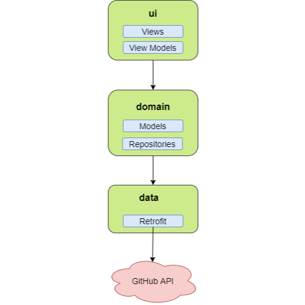

# GitHub Users Android 

## Descrição

Este projeto representa um aplicativo Android simples para consultar informações sobre os usuários do GitHub.

## Configuração e Execução

- Baixar o [Android Studio][1] e Android SDK.
   
    *Nota: Se você já tiver o ambiente de desenvolvimento Android configurado, pule para o próximo passo.*

- Configurar um dispositivo Android ou um emulador Android.
    
    *Nota: Se o seu dispositivo Android não estiver em modo de desenvolvimento, você precisará configurar isso. Leia este [guia][2].*

- Clone ou faça o download do projeto clicando no botão verde __Clone or download__.

- Importar o projeto no Android Studio.

- Executar o projeto clicando no botão verde __play__ do Android Studio.

- Selecione seu dispositivo Android ou emulador Android para executar o aplicativo e clique no botão __OK__.

## Testes

### Testes Unitários

Para executar todos os testes unitários, basta executar a classe __TestSuite__ que está localizada no pacote __test__. Também é possível executar os testes unitários de forma isolada.

### Testes de Interface de Usuário

Para executar os testes de IU, é necessário ter um dispositivo ou emulador Android. Cada tela do aplicativo possui um teste de IU que está localizado no pacote __androidTest__.

*Nota: Para que não ocorra erros durante a execução dos testes, é recomendado que [desabilite as animações][3] do dispositivo ou emulador Android onde os testes serão executados.*

## Estrutura

A estrutura deste projeto é baseada no princípio da [separação de conceitos][4], onde cada componente do software lida com uma responsabilidade de forma modularizada. O objetivo principal da utilização deste conceito é evitar que sejam criadas __God Activities__ ou __God Fragments__, que lidam com outras características que vão além da manipulação de componentes visuais, como por exemplo a realização de acesso aos dados direto dessas classes. Com isso, evita-se a criação de classes [muito extensas][5] e com [mais de uma responsabilidade][6].

## Camadas

O projeto está estruturado em 3 camadas: a camada [__data__](#data), a camada [__domain__](#domain) e a camada [__ui__](#ui). A título de curiosidade, o pacote __di__ lida apenas com a injeção de dependências, utilizando a biblioteca [Dagger 2][7].

Visando manter uma ordem lógica na troca de mensagens entre as camadas, o fluxo acontece da seguinte forma: __ui__ -> __domain__ -> __data__ -> __domain__ -> __ui__.

### Camada data

Esta camada é responsável por lidar com o acesso aos dados, através do consumo de web services. Nesta camada também pode conter o acesso a dados locais, através [Shared Preferences][8], bancos de dados, tais como [Room][9] e [Realm][10] e etc.

### Camada domain

Nesta camada estão contido os repositórios, que expõem um API simples para que a camada de ui possa consultar os dados e as classes de modelo. Dependendo da complexidade da aplicação, no escopo desta camada também pode conter classes que englobam as regras de negócio da aplicação (Use Cases), visando manter uma melhor separação de conceitos.

### Camada ui

Por fim, nesta camada está contido todas as classes de interface de usuário (Activities, Fragments, ViewModels, Adapters, etc).

### Ilustração da arquitetura

[1]: https://developer.android.com/studio/index.html
[2]: https://developer.android.com/studio/debug/dev-options.html
[3]: https://www.howtogeek.com/175033/how-to-speed-up-any-android-phone-by-disabling-animations/
[4]: https://en.wikipedia.org/wiki/Separation_of_concerns
[5]: https://refactoring.guru/smells/large-class
[6]: https://en.wikipedia.org/wiki/Single_responsibility_principle
[7]: https://google.github.io/dagger/
[8]: https://developer.android.com/reference/android/content/SharedPreferences.html
[9]: https://developer.android.com/topic/libraries/architecture/room.html
[10]: https://realm.io/blog/realm-for-android/